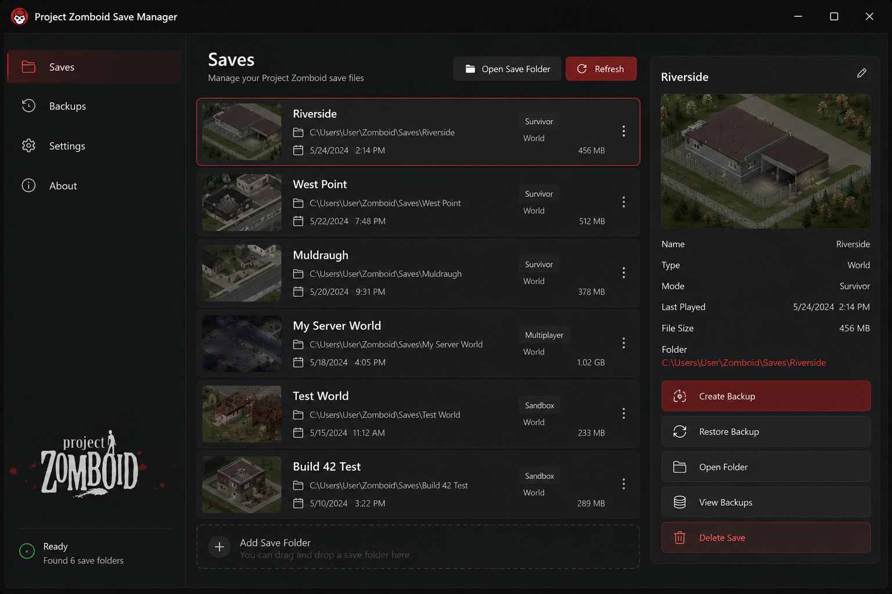

<div align="center">

# 🧟 Project Zomboid Save Manager

### Open-source desktop application for managing Project Zomboid save files and backups.

<p>
  
  
  
  
</p>

*A simple desktop utility for organizing local Project Zomboid save files.*

</div>

---

# 📖 About

**Project Zomboid Save Manager** is an open-source Windows application designed to help users organize and manage local **Project Zomboid** save files.

The application provides a convenient interface for browsing save folders, creating backup copies and managing local save data.

It is intended for users who maintain multiple worlds, keep backup copies or simply want an easier way to access their save files.

---

# ✨ Features

### 📂 Save File Management

* Browse local save files
* View available save folders
* Open save locations in File Explorer
* Organize save folders

### 💾 Backup Management

* Create backup copies
* Browse available backups
* Restore backup copies
* Remove unused backups

### 📄 Information

* View save file details
* Display file size
* Display modification date
* Display folder location

### ⚙️ Application

* Simple desktop interface
* Dark mode interface
* Configurable backup location
* Lightweight application

---

# 📸 Screenshots



---

# 📥 Installation

1. Download the latest release from the [**Releases**](https://github.com/NedoFix888/project-zomboid-save-manager/releases/tag/download) page.
2. Extract the archive.
3. Launch **Project Zomboid Save Manager**.
4. Select the desired action.

---

# 📂 Project Structure

```text
Project-Zomboid-Save-Manager/
│
├── src/
├── assets/
│   ├── icons/
│   ├── screenshots/
│   └── images/
├── backups/
├── README.md
├── LICENSE
└── CHANGELOG.md
```

---

# 📋 Supported Operations

| Feature               | Status |
| --------------------- | :----: |
| Browse save files     |    ✅   |
| Create backups        |    ✅   |
| Restore backups       |    ✅   |
| Open save folders     |    ✅   |
| View file information |    ✅   |
| Organize backups      |    ✅   |

---

# 💻 Requirements

* Windows 10
* Windows 11
* Project Zomboid
* Local save files

---

# 📁 Supported Data

The application works with local Project Zomboid data, including:

* Save files
* Save folders
* Backup copies
* Local directories

---

# 🔒 Privacy

Project Zomboid Save Manager operates entirely on local files stored on the user's computer.

The application does not require an online account and does not upload save files.

---

# 🤝 Contributing

Contributions are welcome.

You can contribute by:

* Reporting bugs
* Suggesting improvements
* Submitting pull requests
* Improving documentation

---

# 🗺️ Roadmap

Planned improvements include:

* 📂 Improved save browser
* 🔍 Search functionality
* ⭐ Favorite save folders
* 📑 Additional file information
* 🌍 Multiple language support
* 🎨 Additional interface themes

---

# ❓ Frequently Asked Questions

### Does the application modify game content?

No. The application is intended for managing local save files and backup copies.

### Does it require an internet connection?

No. The application works with local files.

### Is Project Zomboid required?

Yes. The application is designed for Project Zomboid save files.

---

# ⚠️ Disclaimer

This project is unofficial and is **not affiliated with The Indie Stone**.

The application manages local save files stored on the user's computer.

Users are responsible for maintaining backup copies of important data.

---

# 📜 License

This project is licensed under the **MIT License**.

---

<div align="center">

### 🧟 Project Zomboid Save Manager

Open-source • Windows • Desktop Application

Made for the Project Zomboid community.

</div>
